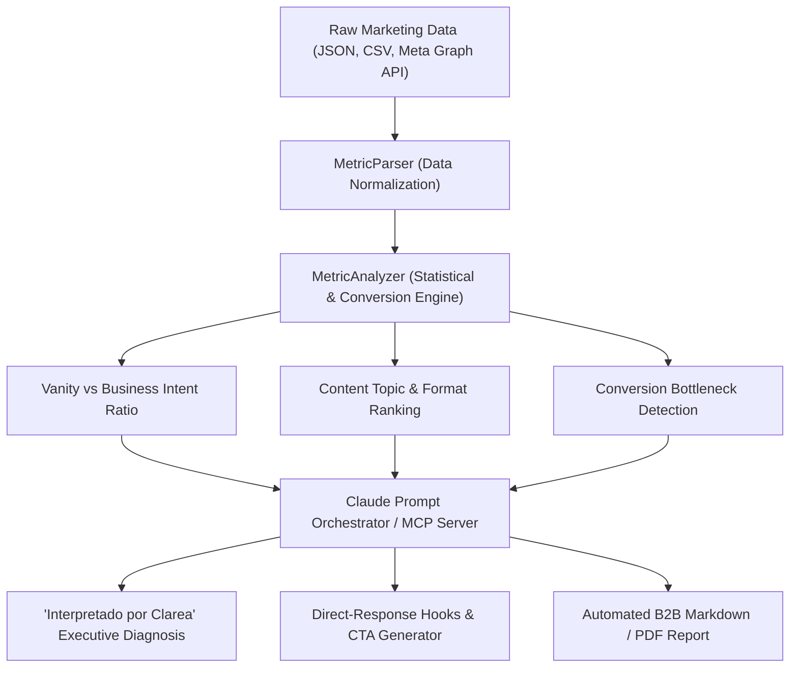

<div align="center">

# ⚡ Clarea Engine
### Open-Source Decision Intelligence & Marketing Analytics Engine for Claude

[](https://opensource.org/licenses/MIT)
[](https://www.python.org/downloads/)
[](https://modelcontextprotocol.io/)
[](tests/)
[](https://anthropic.com/)

> **"Metricool shows you the numbers. Clarea tells you what they mean and what to do next."**

</div>

---

## 💡 What is Clarea Engine?

Most social media and marketing analytics tools (Meta Business Suite, Metricool, Hootsuite, Sprout Social) suffer from the same fundamental limitation: **they display raw numbers without strategic context**. 

Marketers, agencies, and business managers are overwhelmed with graphs of reach, likes, and impressions, but cannot answer critical questions:
- *Why did engagement drop despite higher ad spend?*
- *Which content generated actual sales inquiries versus hollow vanity metrics?*
- *What specific hook and call-to-action should we deploy next week?*

**Clarea Engine** is an open-source framework and native **Model Context Protocol (MCP) Server** designed to bridge this gap. Powered by **Claude 3.5 Sonnet / Claude Code**, it transforms raw engagement and conversion metrics into structured, deterministic business decisions.

---

## 🏗️ Architecture



---

## 🚀 Quickstart

### 1. Installation
```bash
git clone https://github.com/robjesusvilla-ops/clarea-engine.git
cd clarea-engine
pip install -r requirements.txt
```

### 2. Run CLI Analysis
```bash
# Analyze a dataset and output the report
python clarea/cli.py analyze examples/sample_facebook_metrics.json --output executive_report.md
```

### 3. Native Model Context Protocol (MCP) Setup for Claude

Add Clarea Engine to your `claude_desktop_config.json` or `.claude/config.json`:

```json
{
  "mcpServers": {
    "clarea": {
      "command": "python",
      "args": ["-m", "clarea.mcp_server"],
      "cwd": "/path/to/clarea-engine"
    }
  }
}
```

Once connected, Claude can natively execute tools like `clarea_analyze_metrics` and `clarea_generate_hooks_and_ctas` directly inside chat conversations.

---

## 📊 Sample Output (Executive Diagnosis)

```markdown
## 🧠 Strategic Diagnosis: Qhatai Piscinas (Facebook - May 2026)

> **Executive Summary:**  
> Qhatai is capturing strong visibility in Facebook (+18.4% reach growth), 
> driven primarily by 'Completed Projects' photo posts. However, the commercial 
> conversion bottleneck lies in message capture (0.24% conversion rate).
> Next week's priority: shift from general captions to friction-free quote CTAs.

### 🔍 Key Findings:
- Total Reach: 38,450 (+18.4%)
- Direct Inquiries (Quote Requests): 94 (+28.5%)
- Vanity-to-Business Ratio: 0.65 (Healthy commercial balance)
- Top Content Category: 'Completed Projects' (60 inquiries generated across 2 posts)

### ⚡ Recommended Actions:
1. Double down on 'Completed Projects' photo carousels.
2. Replace passive CTAs ('visit our profile') with direct WhatsApp/DM quote links.
3. Deploy educational cost/maintenance posts to pre-qualify high-ticket buyers.
```

---

## 🪝 Python SDK Usage

```python
from clarea.core.parser import MetricParser
from clarea.generators.diagnosis import DiagnosisEngine
from clarea.generators.report import ReportGenerator

# 1. Parse metrics
summary = MetricParser.from_json_file("examples/sample_facebook_metrics.json")

# 2. Generate strategic diagnosis
insight = DiagnosisEngine.generate_local_insight(summary)

# 3. Export full Markdown report
report_md = ReportGenerator.to_markdown(summary, insight)
print(report_md)
```

---

## 🗺️ Roadmap
- [x] Core Metric Parser (JSON & CSV).
- [x] Conversion & Vanity Ratio Statistical Engine.
- [x] Standard Model Context Protocol (MCP) Server for Claude.
- [x] Hook & Direct-Response CTA Generator.
- [ ] Meta Graph API Live Webhook Ingestion.
- [ ] Multi-platform normalization (Instagram, LinkedIn, TikTok).
- [ ] Autonomous weekly client report scheduler via email/Slack.

---

## 📄 License
This project is open-source under the **MIT License**. See [LICENSE](LICENSE) for details.

Developed with ❤️ by **Robert Villa** and contributors.
